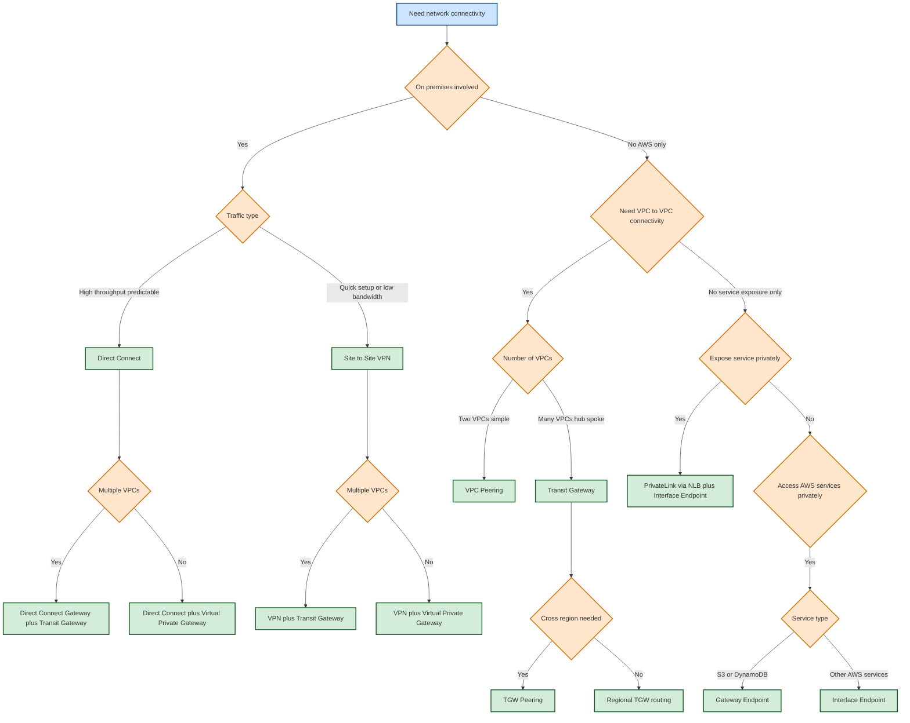
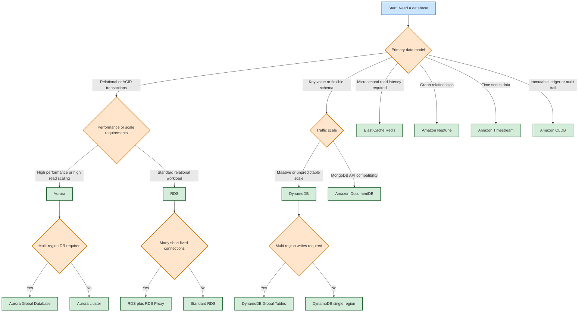
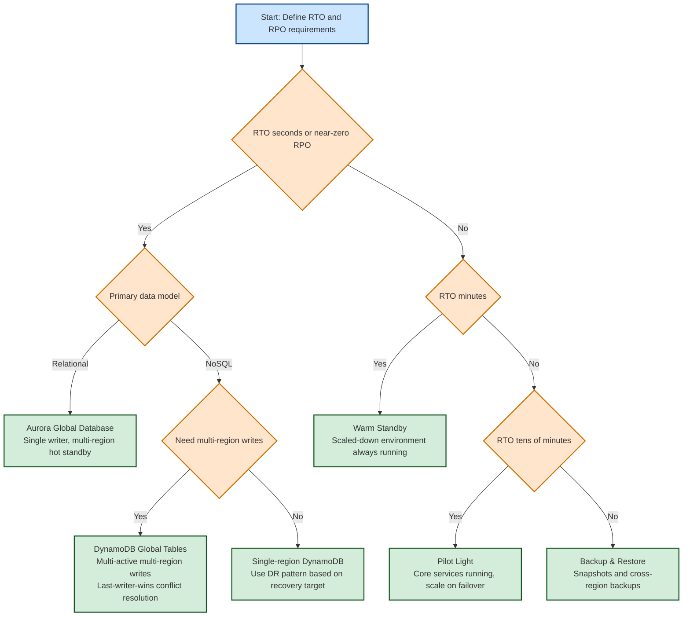
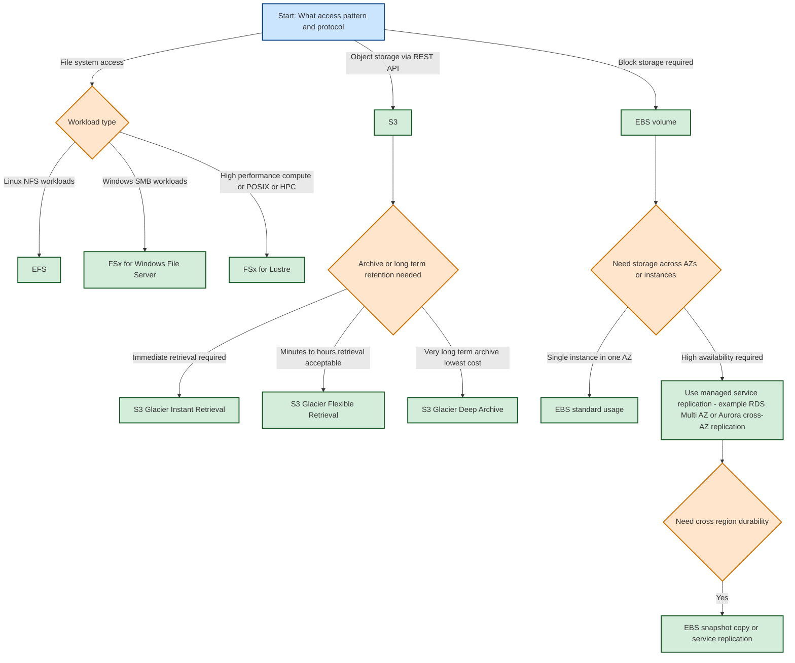
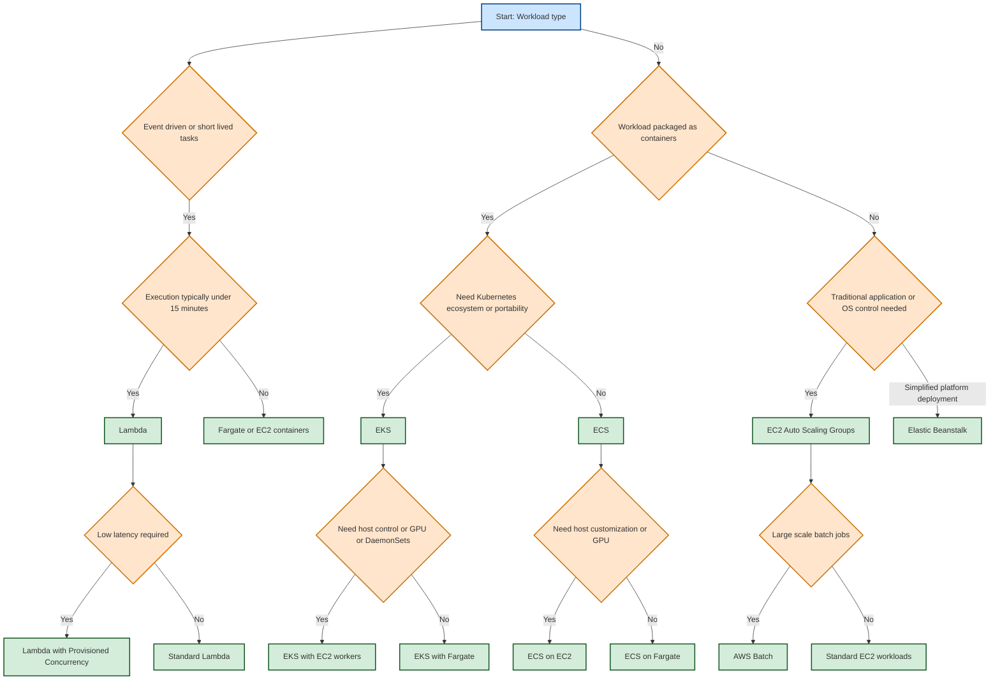
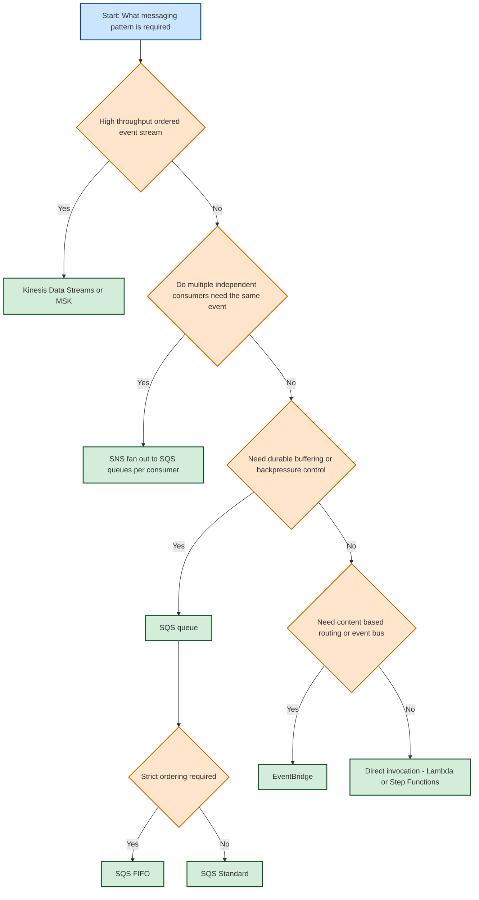

# AWS Architecture Decision Trees

Compact decision trees for common SAP-C02 architecture decisions.

Use as quick heuristics only. Final choices should always align with workload non-functional requirements (RTO/RPO, compliance, cost, operational capability).

---

## Color scheme

| Type | Color | Meaning |
|------|--------|---------|
| Start / Entry | Light Blue | Beginning of flow |
| Decision | Light Orange | Branching logic |
| Service / Action | Light Green | AWS service recommendation |
| Neutral | Light Gray | Optional routing nodes |

---

## 1. Networking — Hybrid & VPC connectivity

## Decision checklist
- **Direct Connect** → predictable high-throughput, low-latency hybrid connectivity.
- **Site-to-Site VPN** → quick setup or temporary hybrid connectivity.
- **Transit Gateway** → many-VPC connectivity or hub-and-spoke network designs.
- **PrivateLink** → private service exposure across accounts or overlapping CIDR ranges.
- **Gateway / Interface Endpoints** → private access to AWS services without internet routing.

---

## 2. Database selection

## Decision checklist
- **Aurora** → high-performance relational workloads, large read scaling.
- **RDS** → standard relational workloads.
- **RDS Proxy** → useful for workloads with many short-lived connections (for example Lambda).
- **DynamoDB** → massive scale or unpredictable traffic.
- **DynamoDB Global Tables** → multi-region active-active writes.
- **ElastiCache (Redis)** → microsecond read latency or caching layer.
- Specialized databases:
  - **Neptune** → graph workloads
  - **Timestream** → time-series data
  - **QLDB** → immutable ledger workloads

---

## 3. Disaster recovery (RTO/RPO)

## Decision checklist
- **Active-Active** → sub-second RTO and near-zero RPO.
- **Warm Standby** → minute-level RTO.
- **Pilot Light** → tens-of-minutes RTO.
- **Backup & Restore** → hours-level RTO.
- **Operational practice** → automate failover where possible and regularly test recovery procedures.

---

## 4. Storage selection

## Decision checklist
- **S3** → object storage. **EFS / FSx** → file systems. **EBS** → block storage.
- **Glacier storage classes** → selected based on retrieval latency and cost requirements.
- **EBS** → AZ-scoped; use replication or managed services for high availability.
- **Cross-region durability** → snapshot copy or service-level replication.
- **Lifecycle policies** → move data automatically to lower-cost storage classes.

---

## 5. Compute selection

## Decision checklist
- **Lambda** → sub-15-minute event-driven tasks.
- **Provisioned Concurrency** → low-latency Lambda workloads.
- **EKS** → Kubernetes ecosystem and portability.
- **ECS** → simpler container orchestration.
- **EC2-based containers (EKS/ECS on EC2)** → GPU workloads or host customization.
- **EC2 Auto Scaling Groups / Elastic Beanstalk** → traditional application deployments.
- **AWS Batch** → large-scale batch processing workloads.

---

## 6. Messaging / Event Architecture

## Decision checklist
- **Kinesis / MSK** → high-throughput, ordered event streams.
- **SNS → SQS fan-out** → multiple independent consumers need the same event.
- **SQS** → durable buffering and backpressure.
- **SQS FIFO** → strict ordering requirements.
- **EventBridge** → content-based routing and event bus architectures.
- **Direct Lambda / Step Functions invocation** → when buffering or queueing is not required.
- **Operational settings** → configure DLQs, visibility timeouts, and message retention appropriately.
